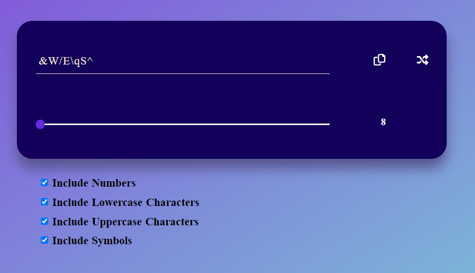

An application for generating random passwords. 
To create a password, it is necessary to enter its length (8-20 characters) and indicate by ticking the boxes what types of characters should appear in the password. After clicking on the arrow icon, a new password will be generated. 
The application was created using an online tutorial.

